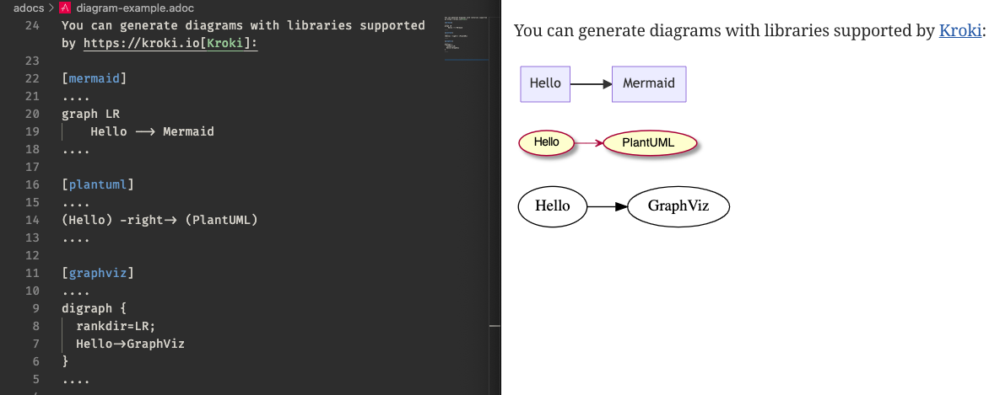
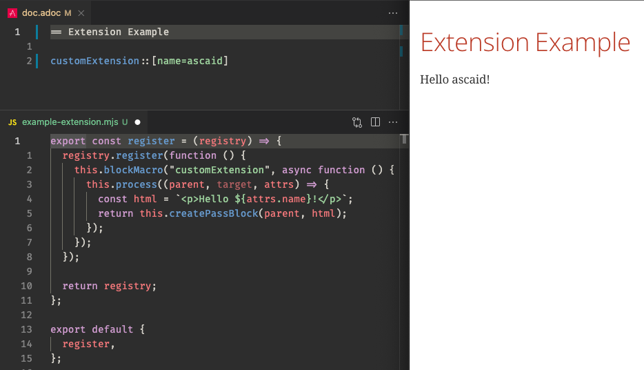
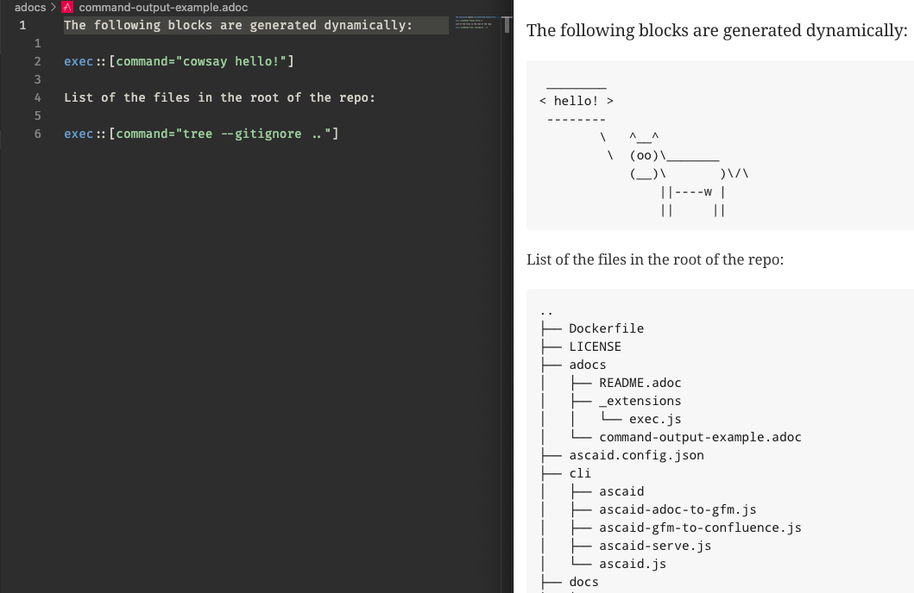

<div id="header">

</div>

<div id="content">

<div class="sect1">

## ascaid: Hassle-free documentation generation powered by AsciiDoc

<div class="sectionbody">

<div class="sect2">

### TL;DR

<div class="paragraph">

⚡️ Write documents in [AsciiDoc](https://asciidoctor.org) format

</div>

<div class="paragraph">

⚡️ Include text-based diagrams in your documents:

</div>

<div class="imageblock">

<div class="content">



</div>

</div>

<div class="paragraph">

⚡️ Extend AsciiDoc with custom extensions:

</div>

<div class="imageblock">

<div class="content">



</div>

</div>

<div class="imageblock">

<div class="content">



</div>

</div>

<div class="paragraph">

⚡️ Publish your documents to Confluence and code hosting services

</div>

</div>

<div class="sect2">

### Longer Description

<div class="paragraph">

**ascaid** makes it easy to write partially-generated documentation in AsciiDoc format. Generating the documentation can help with reducing [documentation CRUFT](http://agilemodeling.com/essays/agileDocumentation.htm).

</div>

<div class="paragraph">

Under the hood, **ascaid** uses [Asciidoctor.js](https://docs.asciidoctor.org/asciidoctor.js/latest) and [Pandoc](https://pandoc.org) and offers the following main features:

</div>

<div class="ulist">

-   It can be configured to load [Asciidoctor.js Extensions](https://docs.asciidoctor.org/asciidoctor.js/latest/extend/extensions/ecosystem)

-   It includes a live server to help with writing AsciiDoc documents

-   It can convert Asciidoc files to [GitHub Flavored Markdown](https://github.github.com/gfm)

-   It can publish GitHub Flavored Markdown files to [Confluence](https://www.atlassian.com/software/confluence)

</div>

<div class="paragraph">

The following diagram shows a typical document writing and publishing workflow with **ascaid**.

</div>

<div class="imageblock kroki">

<div class="content">


</div>

</div>

<div class="paragraph">

*Note: This document is generated with* ***ascaid*** *itself.* *Check out the source [here](./README.adoc).*

</div>

</div>

<div class="sect2">

### Installation

<div class="sect3">

#### Requirements

<div class="olist arabic">

1.  A Unix-like operating system ([WSL](https://docs.microsoft.com/en-us/windows/wsl) is also supported)

2.  [Bash](https://www.gnu.org/software/bash)

3.  [Node.js v16+](https://nodejs.org)

4.  [Pandoc](https://pandoc.org)

</div>

<div class="paragraph">

You can install the package globally with npm:

</div>

<div class="listingblock">

<div class="content">

    npm install -g ascaid

</div>

</div>

</div>

</div>

<div class="sect2">

### CLI Usage

<div class="sect3">

#### `ascaid help`

<div class="literalblock">

<div class="content">

    Usage: ascaid [options] [command]

    Hassle-free documentation generation powered by AsciiDoc

    Options:
      -V, --version                  output the version number
      -h, --help                     display help for command

    Commands:
      serve [directory]              start an AsciiDoc server
      adoc-to-gfm <srcDir> <outDir>  AsciiDoc -> GitHub flavored markdown
      gfm-to-confluence <dir>        Publish a GitHub flavored markdown directory
                                     to Confluence
      help [command]                 display help for command

</div>

</div>

</div>

<div class="sect3">

#### `ascaid serve`

<div class="literalblock">

<div class="content">

    Usage: ascaid-serve [options] [rootDir]

    Start an AsciiDoc server

    Arguments:
      rootDir        server root directory (default: current directory)

    Options:
      -V, --version  output the version number
      -h, --help     display help for command

</div>

</div>

</div>

<div class="sect3">

#### `ascaid adoc-to-gfm`

<div class="literalblock">

<div class="content">

    Usage: ascaid-adoc-to-gfm [options] <srcDir> <outDir>

    Recursively convert AsciiDoc files in a directory to GitHub flavored markdown

    Arguments:
      srcDir                source directory
      outDir                output directory

    Options:
      -V, --version         output the version number
      --ignore [ignore...]  glob patterns to ignore (default: ["**/_*"])
      -h, --help            display help for command

</div>

</div>

</div>

<div class="sect3">

#### `ascaid gfm-to-confluence`

<div class="literalblock">

<div class="content">

    Usage: ascaid-gfm-to-confluence [options] <dir>

    Recursively publish a GitHub flavored markdown directory to Confluence

    Arguments:
      dir                                dir to publish to Confluence

    Options:
      -V, --version                      output the version number
      --api-base-url [apiBaseUrl]        Confluence API base URL (default:
                                         CONFLUENCE_API_BASE_URL environment
                                         variable)
      --api-username [apiUsername]       Confluence API username (default:
                                         CONFLUENCE_API_USERNAME environment
                                         variable)
      --api-password [apiPassword]       Confluence API password (default:
                                         CONFLUENCE_API_USERNAME environment
                                         variable)
      --space-key [spaceKey]             Confluence space key (default:
                                         CONFLUENCE_SPACE_KEY environment variable)
      --root-page-id [rootPageId]        Confluence root page ID (default:
                                         CONFLUENCE_ROOT_PAGE_ID environment
                                         variable)
      --root-page-title [rootPageTitle]  Confluence root page title (default:
                                         CONFLUENCE_ROOT_PAGE_TITLE environment
                                         variable)
      -h, --help                         display help for command

</div>

</div>

</div>

</div>

<div class="sect2">

### Config File

<div class="paragraph">

You can optionally use a config file to register custom extensions and set [Asciidoctor.js](https://docs.asciidoctor.org/asciidoctor.js/latest) options. On startup, **ascaid** looks for a config file named `ascaid.config.json` in the current working directory. The following block shows an example config file:

</div>

<div class="listingblock">

<div class="content">

``` highlight
{
  // JSON comments will be striped out

  "extensions": ["./path/to/extension.js"],

  // https://docs.asciidoctor.org/asciidoctor/latest/api/options/
  "asciidoctorOptions": {
    "attributes": {
      "kroki-server-url": "http://my-server-url:port"
    }
  }
}
```

</div>

</div>

</div>

<div class="sect2">

### Extensions

<div class="paragraph">

**ascaid** supports [Asciidoctor.js Extensions](https://docs.asciidoctor.org/asciidoctor.js/latest/extend/extensions/ecosystem).

</div>

<div class="paragraph">

[Asciidoctor Kroki Extension](https://github.com/Mogztter/asciidoctor-kroki) is included by default to make it more convenient to use **ascaid** without a config file.

</div>

<div class="paragraph">

An example implementation of a custom extension can be found [here](../examples/asciidoctor-extension).

</div>

</div>

<div class="sect2">

### Publishing Documents to Confluence

<div class="paragraph">

In order to publish [AsciiDoc](https://asciidoctor.org) documents to [Confluence](https://www.atlassian.com/software/confluence), you should first convert them to [GitHub Flavored Markdown](https://github.github.com/gfm) (see [CLI Usage](#_cli_usage) for more info). Then you’ll need to create an [API token](https://id.atlassian.com/manage/api-tokens) and a root page to publish the documents under. An example project with GitHub Actions integration can be found [here](../examples/github-actions-publish-to-confluence).

</div>

</div>

</div>

</div>

</div>

<div id="footer">

<div id="footer-text">

Last updated 2022-03-15 16:38:39 +0100

</div>

</div>
